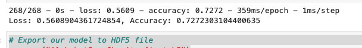
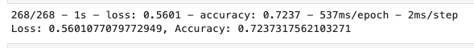
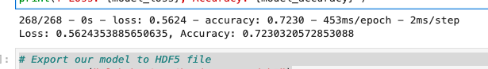

# Neural_Network_Charity_Analysis

## Overview
* The purpose of this challenge was to create a binary classifier that is capable of predicting whether applicants will be successful if funded by Alphabet Soup.

## Results
* Our first attempt to increase accuracy of the model was to add a third hidden layer. This was the result.
* 

* Our second attempt to increase accuracy of the model was to add a third hidden layer and increase the neurons to 10 15 and 20. This was the result.
* 

* Our third attempt to increase accuracy of the model was to add a third hidden layer and switch the activations from Relu to Tanh. This was the result.
* 

## Conclusion

* We were not able to hit 75% accuracy. Our best result was adding a third hidden layer with our original attempt.
